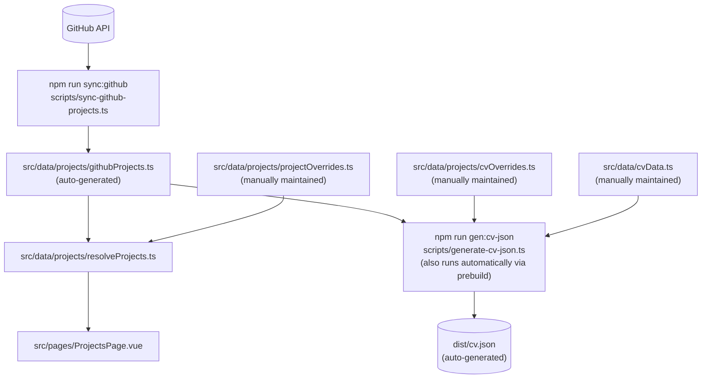

# Standalone scripts that perform special development functions

## GitHub Auth Token

`sync:github` reads `GITHUB_TOKEN` from `.env` in the project root (gitignored). Without it the script still works but is subject to GitHub's unauthenticated rate limit (60 req/hr).

**Creating a token:**

1. Go to GitHub → Settings → Developer settings → Personal access tokens → Fine-grained tokens
2. Click **Generate new token**
3. Set an expiry, select your account as the resource owner
4. Copy the token and paste it as `GITHUB_TOKEN=<token>` in `.env`

---

## CV JSON Generation Scripts

| File Name                 | `npm run` command | Function                                                                                                                         |
| ------------------------- | ----------------- | -------------------------------------------------------------------------------------------------------------------------------- |
| `sync-github-projects.ts` | `sync:github`     | Pulls GitHub projects into `src/data/projects/githubProjects.ts`                                                                 |
| `generate-cv-json.ts`     | `gen:cv-json`     | Generates `cv.json` by combining `githubProjects.ts`, `cvOverrides.ts`, and `cvData.ts`. Also runs automatically via `prebuild`. |
| `render-pdf.ts`           | `render:pdf`      | Navigates to `.../cv` and renders `public/cv.pdf` using Playwright                                                               |

### CV JSON Pipeline

## CV Schema Generation Scripts

| File Name               | `npm run` command | Function                                                                                                                           |
| ----------------------- | ----------------- | ---------------------------------------------------------------------------------------------------------------------------------- |
| `generate-cv-schema.ts` | `gen:cv-schema`   | Pulls the `jsonresume.org` JSON Schema and generates `src/data/models/CV.ts` TypeScript CV type definition using `jsonSchemaToZod` |

## Theme Validation Scripts

| File Name              | `npm run` command   | Function                                       |
| ---------------------- | ------------------- | ---------------------------------------------- |
| `validate-themes.ts`   | `validate:themes`   | Makes sure that the themes are set up properly |
| `validate-contrast.ts` | `validate:contrast` | Makes sure that the themes are WCAG compliant  |
